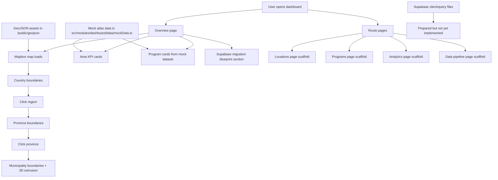

# TESDA Dashboard (Looker Migration Prototype)

A Next.js prototype for migrating a TESDA reporting experience into an interactive web dashboard.

## What the site currently does

- Renders an interactive Philippines map using Mapbox GL.
- Supports geographic drilldown behavior across `country -> region -> province -> municipality/city` using GeoJSON boundary files.
- Shows selected-area KPI cards and hero metrics on the overview page.
- Displays area-specific program cards (`scholars`, `non-scholars`, `completion rate`) from structured mock data.
- Includes dedicated pages for:
  - `/` Overview dashboard
  - `/locations` Geographic workspace scaffold
  - `/programs` Program intelligence scaffold
  - `/analytics` KPI/trend scaffold
  - `/data-pipeline` ingestion and readiness scaffold
- Documents a data model direction for Supabase-backed migration (`locations`, `location_metrics`, `location_programs`).

## Capability chart (current state)



## Tech stack

- Next.js 16 (App Router)
- React 19
- TypeScript
- Tailwind CSS v4
- Mapbox GL JS

## Run locally

```bash
npm install
npm run dev
```

Open [http://localhost:3000](http://localhost:3000).

## Required environment variable

Set this in `.env.local`:

```bash
NEXT_PUBLIC_MAPBOX_TOKEN=your_mapbox_public_token
```

Without this token, the UI renders but the map shows a configuration error state.

## Notes on data maturity

- The app already has rich UI behavior and full geographic boundary assets.
- Several KPI/program values are currently mock placeholders.
- Supabase integration files exist but are still empty, so backend data fetching is not yet active.
